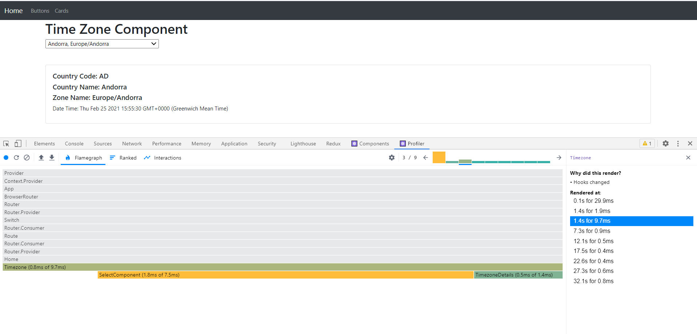

# Portfolio
---
## ReactJS

### React-hooks

This is just a collection of different methods available in ReactJS and to understand how hooks to be used in ReactJS.

It covers the basics of hooks usage and modular pattern coding. The code uses all the best practices and explains the usage of tools like Profiler in detail. It uses TypeScript, and testing library along with Redux to save data.

Its a pretty simple application to show timezone for different locations and to keep it updated after an interval of 5 seconds. The purpose of this code was to leverage ReactJS properly and to show how we can stop components being rerendered again. To make sure the components are not rerendered, we used Profiler (chrome extension) that gives us the list of components rendered and give all the required information that a developer should expect.

---

### Component Dictionary

A basic application developed to show component library in storybook. This app is a bootstrap component for creating a component library. Storybook was integrated to show the look and feel of a component with different color size and themes

---

### Space-X (NextJS Server side rendering)

This was an assignment to do server side rendering using NextJS which was build in TypeScript. This is a single page application developed responsively to render data quickly. This was deployed on 

